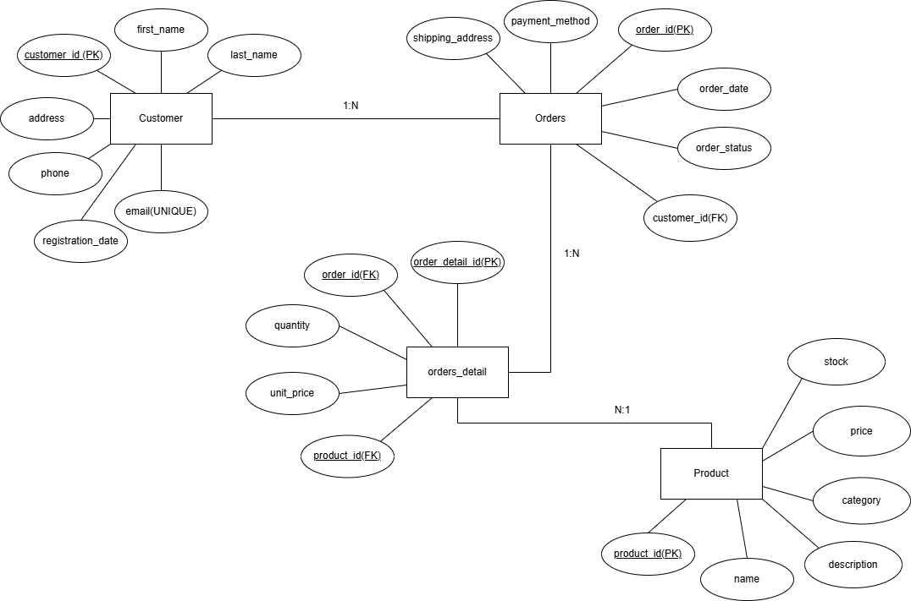

# Online Store Database
This project is a relational database design for an e-commerce platform.

Features
- Customer management
- Product catalog
- Order processing
- Order details tracking

Database Design
The database follows Third Normal Form (3NF) to ensure:
- No data redundancy
- Data integrity
- Scalability

Entities
- Customer
- Product
- Orders
- Order_Detail

Relationships
- One customer can have multiple orders
- One order can contain multiple products
- Many-to-many relationship resolved via Order_Detail

Technologies
- MySQL (running on XAMPP local server)  
- SQL (Data Definition Language & Data Manipulation Language)  
- DBeaver (database client for development and testing)  

How to Run
1. Open DBeaver
2. Connect to MySQL
3. Run `schema.sql`
4. (Optional) Run `sample_data.sql`
5. Test queries from `queries.sql`

ER Diagram

